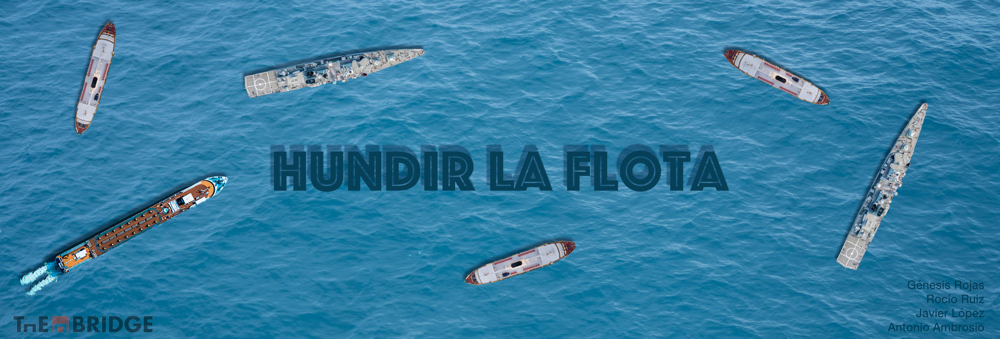

**Descripción del juego**
-----------
Juego desarrollado en lenguaje python, utilizando 5 scripts: bienvenida, constants, partida, tableros y main, los cuales contienen las funciones necesarias para su ejecución. Durante la partida, se reproducen varios sonidos para hacer el juego más interesante. Los ficheros de audio están separados en el directorio _media_.

**Dinámica del juego**
-----------
Para iniciar el programa de juego hemos creado una bienvenida donde se saluda al usuario (jugador) y le presenta a su contrincante (la máquina, a quien hemos llamado "Popeye"). 

A continuación hemos creado cuatro tableros, dos con la función _np.full_ (**tablero_impactos_maquina** y **tablero_impactos_jugador**)  para los tableros vacíos donde se van a ir reflejando los impactos, y otros dos tableros con la función _iniciar_tablero_con_barcos_ (**tablero_barcos_maquina** y **tablero_barcos_maquina**) donde se colocarán los barcos de forma aleatoria (del jugador y de la máquina). 

Una vez que ya tenemos los barcos colocados en los tableros, iniciamos el juego dándole el turno al jugador con la función **turnojugador**. Aquí el jugador debe de ir introduciendo unas coordenadas de número y letra que serán los disparos en el tablero. Con la función **turnojugador**, si  las coordenadas coinciden con una parte de alguno de los barcos de la máquina colocados aleatoriamente, se introducirá un simbolo *X*. En caso contrario, si lo que toca es agua, el simbolo que aparecerá será *-*. 

Si el jugador toca alguna de las partes del barco, repite turno, en caso contrario, es el turno de la máquina a través de la función **juegomaquina**, que repite la misma lógica que **turnojugador**.

**Fin del juego**
-----------

El juego termina con la función _fin_de_juego_, la cual comprueba si existen aún barcos en el tablero de la máquina o el tablero del jugador, dando fin a la partida al cumplirse alguna de estas dos condiciones. 

-----------
#### Librerías utilizadas
* Numpy
* Random
* Time
* PyGame

#### Autores
* Génesis Rojas
* Javier López
* Antonio Ambrosio
* Rocío Ruiz
